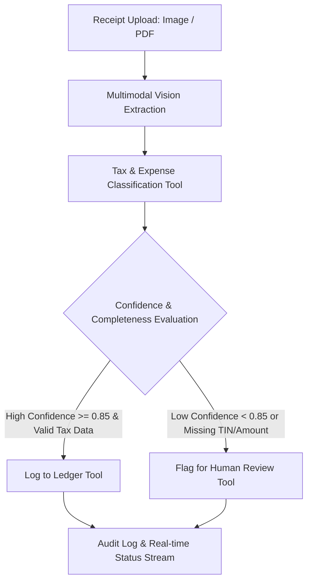

# TaxCore AI — Autonomous Receipt & Fiscal Document Agent

[](https://www.typescriptlang.org/)
[](https://ai.google.dev/)
[](https://react.dev/)
[](https://nodejs.org/)

An autonomous, agentic document-processing engine built for Ethiopian business accounting and ERP operations. It processes physical receipts, fiscal machine slips, and invoices into structured ledger entries with compliance validation and automated human-in-the-loop escalation.

---

## The Problem & Domain Context

Small and medium enterprises (SMEs) in Ethiopia face significant operational overhead and tax penalty risks during manual ledger entry:
1. **Fiscal Machine Variations**: Thermal receipts often suffer from fading, ink smudging, or non-standard formatting across different POS models.
2. **Tax Compliance Rules**: Ethiopian tax proclamations require strict distinction of 15% standard VAT, exempt items, and 2% withholding tax thresholds (e.g., transactions >= 10,000 ETB for goods, >= 3,000 ETB for services).
3. **The AI Hallucination Risk**: Naive OCR/LLM pipelines attempt to guess illegible numbers. In accounting, guessing is unacceptable.

---

## Agentic Architecture & Execution Loop

TaxCore AI uses an autonomous decision loop powered by Gemini Function Calling rather than a rigid linear pipeline:



### Key Engineering Decisions

- **Autonomous Tool Routing**: The agent decides dynamically which tool to invoke based on document condition and domain rules.
- **Fail-Safe Fallbacks (Zero-Guessing Policy)**: If image fidelity is low or key tax markers (such as TIN or Total) are ambiguous, the agent actively triggers `flagForReview` with explicit diagnostic rationale.
- **Client-Orchestrated Multi-Turn State**: The backend maintains an audit trail (`AgentStepLog`) of every tool decision, argument payload, and confidence metric for regulatory transparency.

---

## Project Structure

```
receipt-agent/
├── backend/
│   ├── src/
│   │   ├── agent/
│   │   │   ├── tools.ts          # Gemini Function Declarations & local executors
│   │   │   ├── agentLoop.ts      # Multi-turn autonomous agent orchestration
│   │   │   └── visionService.ts  # Multimodal extraction pipelines
│   │   ├── routes/               # Express API endpoints
│   │   ├── services/             # In-memory ledger & state persistence
│   │   ├── types/                # Strict domain TypeScript models
│   │   └── index.ts              # Server bootstrap
│   ├── package.json
│   └── tsconfig.json
└── frontend/
    ├── src/
    │   ├── components/           # Upload, real-time status feed, audit table
    │   ├── services/             # API transport layer
    │   └── App.tsx
    └── vite.config.ts
```

---

## Getting Started

### Prerequisites
- Node.js >= 20.x
- Google Gemini API Key

### Backend Setup
```bash
cd receipt-agent/backend
npm install
# Add your GEMINI_API_KEY to .env
npm run test:tool
```
